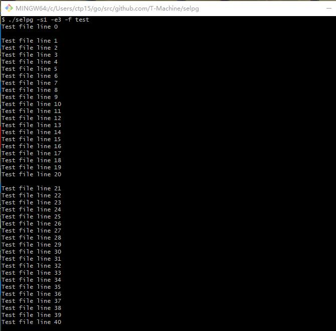
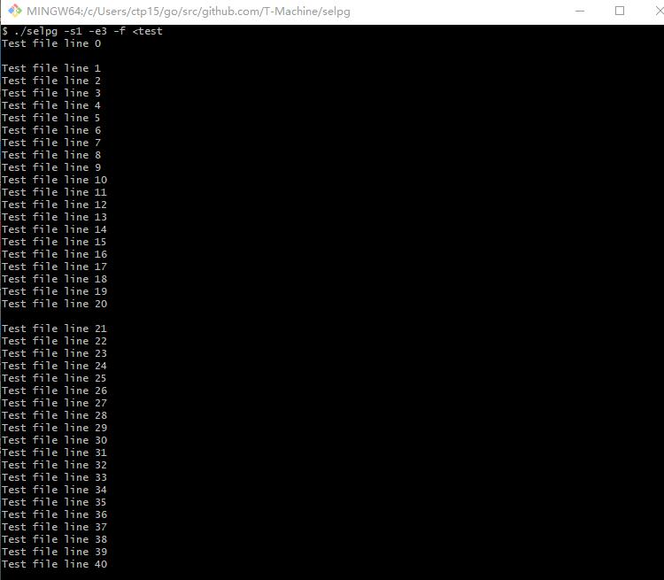
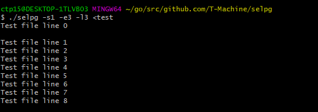
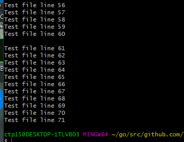
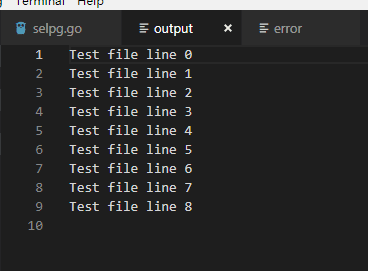
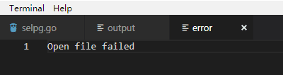
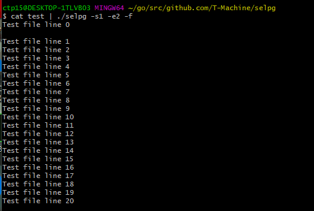
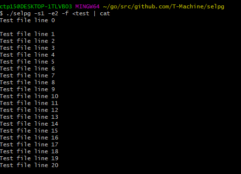
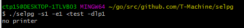

### 测试使用

首先编写一个程序用于生成测试文本。每20行插入一个'\f'（第0行之后也有一个'\f'）。

```go
package main
import (
    "strconv"
    "fmt"
    "io/ioutil"
)

func main() {
    name := "test.txt"
    content := ""
    for i := 0; i < 100; i ++ {
        content = content + "Test file line " + strconv.Itoa(i) + "\n"
        if i % 20 == 0 {
            content = content + "\f"
        }
    }
    data :=  []byte(content)
    if ioutil.WriteFile(name,data,0644) == nil {
        fmt.Println("写入文件成功:",content)
    }  
}
```

#### 1.使用-f从指定文件输入

```
$ ./selpg --s 1 --e 3 --f test
```

使用-f参数，读取test文件，每20行一页（第一行单独一页），输出如下：



#### 2.通过"<"重定向标准输入

```
$ ./selpg --s 1 --e 3 --f <test
```

使用重定向来读取test，参数同上，输出如下：



#### 3.用-l参数指定每页行数

```
$ ./selpg --s 1 --e 3 --l 3 <test
```

输出前9行，内容如下：



#### 4.不输入-l或-f

```
$ ./selpg -s1 -e1 <test
```

不指定-l和-f，默认每页72行，输出前72行，内容如下：



#### 5.输出导向output文件

```
$ ./selpg --s 1 --e 3 --l 3 <test >output
```

将前9行导出至output文件，查看该文件，内容如下，可以看到前9行被成功导出。



#### 6.错误内容导向error文件

```
$ ./selpg --s 1 --e 1 --l 3 test2 2>error
```

打开一个错误的文件作为非法输入，查看error文件，内容如下，可以看到导出了错误信息。



#### 7.将other_command的输出作为输入

```
$ cat test | ./selpg --s 1 --e 2 --f
```

使用cat命令读取test文件，然后将输出重定向到selpg的输入，读取前两页（21行），输出如下：



#### 8.将输出作为other_command的输入

```
$ ./selpg -s1 -e2 -f <test | cat
```

读取test的前两页（21行），将输出重定向到cat命令的输入，输出如下：



#### 9.-d参数

```
$ ./selpg -s1 -e1 <test -dlp1
```

由于没有打印机，所以输出错误信息：


